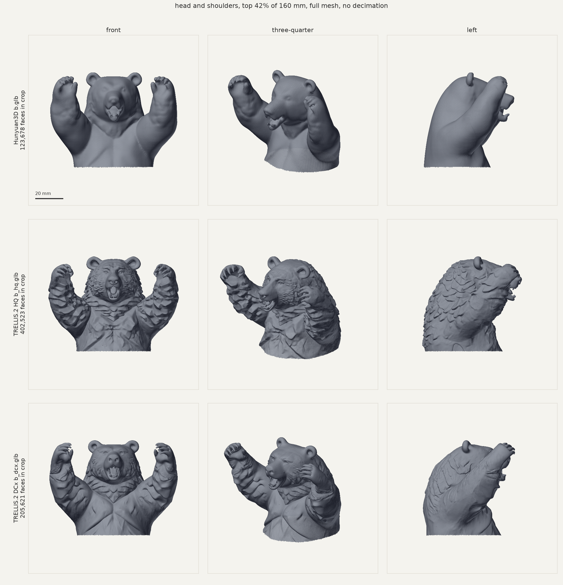
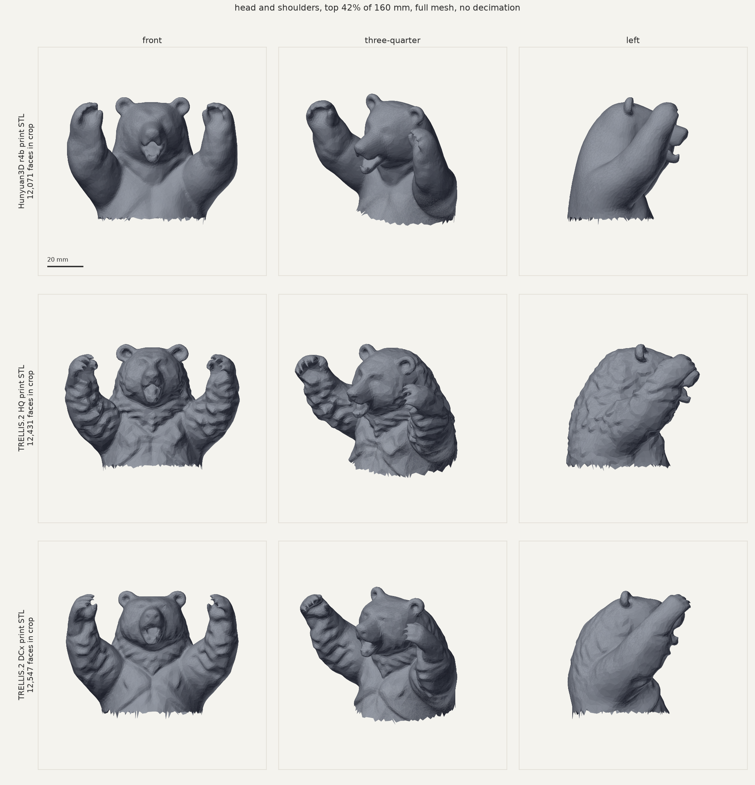

# TRELLIS.2 vs Hunyuan3D for Stage 2 (bear b, round 4z)

**Verdict: yes, TRELLIS.2 carries the carved fur that Hunyuan3D loses, it
survives our repair chain, and the printability cost is small. It is worth
switching Stage 2 to TRELLIS.2 for the final bear.** Details, numbers and the
caveats below.

Evaluated 2026-09-10 on `outputs/stage2_mesh/round4z/b_cutout.png` (the chosen
grizzly, rearing with arms up on a rock) against Hunyuan3D's
`outputs/stage2_mesh/round4z/b.glb`.

## 1. The environment

TRELLIS.2 runs in a **second, isolated ComfyUI** because the
[ComfyUI-Trellis2](https://github.com/visualbruno/ComfyUI-Trellis2) wrapper
needs prebuilt CUDA extensions (cumesh, flex_gemm, o_voxel, nvdiffrast) that are
compiled against torch 2.10.0 / CUDA 13.1. Under the torch 2.13.0+cu130 in
`workspaces\default` they fail with `DLL load failed ... The specified procedure
could not be found` (C++ ABI mismatch). Nothing in `workspaces\default` or
`workspaces\wkf` was touched.

| item | value |
|---|---|
| workspace | `D:\tools\comfy\workspaces\trellis` (fresh ComfyUI clone, commit `1f641fd`) |
| port | **8190** (default is 8188, wkf is 8189) |
| Python | 3.12.13 (uv-managed CPython) |
| torch | **2.10.0+cu130**, torchvision 0.25.0+cu130, torchaudio 2.10.0+cu130, from `https://download.pytorch.org/whl/cu130` |
| triton | triton-windows 3.6.0.post26 |
| node pack | copy of `workspaces\default\custom_nodes\ComfyUI-Trellis2.disabled` (commit `1459741`), 88 nodes registered |
| CUDA wheels | `custom_nodes\ComfyUI-Trellis2\wheels\Windows\Torch2100\CUDA 13.1\` **cp312**: cumesh 0.0.1, flex_gemm 1.0.0, o_voxel 0.0.1, nvdiffrast 0.4.0, custom_rasterizer 0.1 |
| DCx | `dcx_pkg` ships only as cp313; a **cp312 wheel was built from source** (github.com/jjjkkyz/DCx, scikit-build-core + pybind11, CPU only, VS 2022 Build Tools) and kept at `...\CUDA 13.1\built-here\dcx_pkg-0.0.1-cp312-cp312-win_amd64.whl` |
| models | auto-downloaded into the shared `D:\comfyshared\ComfyModels`: `microsoft\TRELLIS.2-4B` (16.2 GB), `facebook\dinov3-vitl16-pretrain-lvd1689m` (ungated mirror, 1.2 GB), `microsoft\TRELLIS-image-large\ckpts\ss_dec_conv3d_16l8_fp16` |

Build, in order (each `uv pip install` targets the trellis venv):

```
git clone --depth 1 https://github.com/comfyanonymous/ComfyUI D:\tools\comfy\workspaces\trellis
uv venv D:\tools\comfy\workspaces\trellis\.venv --python 3.12.13
uv pip install --python .venv\Scripts\python.exe pip torch==2.10.0+cu130 torchvision==0.25.0+cu130 torchaudio==2.10.0+cu130 --index https://download.pytorch.org/whl/cu130
uv pip install --python .venv\Scripts\python.exe -c torch_constraints.txt --index https://download.pytorch.org/whl/cu130 -r requirements.txt
uv pip install --python .venv\Scripts\python.exe -c torch_constraints.txt -r custom_nodes\ComfyUI-Trellis2\requirements.txt huggingface_hub trimesh "triton-windows<3.7"
uv pip install --python .venv\Scripts\python.exe "wheels\...\CUDA 13.1\{cumesh,flex_gemm,o_voxel,nvdiffrast,custom_rasterizer}-*-cp312-*.whl"
uv pip install --python .venv\Scripts\python.exe "wheels\...\CUDA 13.1\built-here\dcx_pkg-0.0.1-cp312-cp312-win_amd64.whl"
.venv\Scripts\python.exe -c "import cumesh, flex_gemm, o_voxel, nvdiffrast, dcx_pkg"
```

`torch_constraints.txt` pins the three torch packages so the ComfyUI
requirements cannot pull a newer torch over them.

Launch and stop:

```
D:\tools\comfy\workspaces\trellis\start.ps1          # detached, logs in .\logs\server.log
D:\tools\comfy\workspaces\trellis\start.ps1 -Stop
```

The script runs `main.py --port 8190 --output-directory D:\sync\Comfy
--input-directory D:\sync\Comfy\input --models-directory D:\comfyshared\ComfyModels
--listen=0.0.0.0 --verbose INFO --log-stdout`, so meshes land in
`D:\sync\Comfy\3D\` like everything else.

GPU sharing: one 24 GB card. Free the other server first
(`POST http://127.0.0.1:8188/free {"unload_models":true,"free_memory":true}`)
and never generate on 8188 and 8190 at once. A run peaks at about 14 GB VRAM
with `low_vram` on; system commit stayed near 102 of 160 GB.

## 2. What was run

Two example graphs from the pack, converted to API format with the bear cutout
swapped in, `backend=sdpa` (no flash_attn wheel for this torch), and the
`Preview3D` node dropped. Everything else is the example's own settings.

| run | graph | key settings | wall time |
|---|---|---|---|
| **HQ** | `MeshOnly_HighQuality.json` | sparse res 64, shape 1024 then cascade to 1536, heun 12 steps, `ReconstructMeshWithQuad` 1024, Cumesh simplify to 1M, Meshlib hole fill | 21:22 incl. the 16 GB download; ~12 min of generation (HR sampling ~30 s/step) |
| **DCx** | `Gen Mesh Only with Trellis2 DCx.json` | sparse res 32, shape 512 then cascade to 1024, heun 12 steps, `RemeshWithQuad` 1024 then `ReconstructMeshDCx` res 1024 / 200 M stratified points, simplify to 500k, Meshlib hole fill | 8:05 total; DCx CPU stages ~3 min (inner-face cull 89 s, contouring 87 s, winding fix 6 s) |

Note the two TRELLIS runs differ in generation settings (seed, 1536 vs 1024
cascade, guidance rescale), not only in the extractor, so "HQ vs DCx" mixes
both. An apples-to-apples extractor test (same latent through
`ReconstructMeshWithQuad` and `ReconstructMeshDCx`) is the obvious follow-up.

Outputs (raw GLBs are local only, gitignored):

- `outputs/stage2_mesh/round4z_trellis/b_hq.glb`, `b_dcx.glb`, and `b.glb` (= DCx, the one recommended below)
- `outputs/stage2_mesh/round4z_trellis/b_hq_print.stl`, `b_dcx_print.stl` (committed)

## 3. Roughness

`python tools/mesh_roughness.py <meshes> --height 160`: every mesh scaled to
160 mm tall, then mean / p90 / p99 of `numpy.degrees(mesh.face_adjacency_angles)`.

Raw generator output:

| mesh | faces | area mm² | mean | p90 | p99 |
|---|---:|---:|---:|---:|---:|
| Hunyuan3D `round4z/b.glb` | 301,014 | 42,709 | 2.59 | 5.55 | 25.29 |
| TRELLIS.2 HQ `b_hq.glb` | 995,352 | 49,711 | 5.22 | 13.13 | 47.93 |
| TRELLIS.2 DCx `b_dcx.glb` | 503,374 | 46,684 | 5.10 | 12.45 | 48.46 |

TRELLIS.2 is 2.2 to 2.4 times rougher than Hunyuan at p90 and 1.9 times at
p99, with 1.7 to 3.3 times the faces to carry it. The close-up shows this is
real detail, not noise: fur clumps on the head, back and forearms, a chest
ruff, an open mouth with teeth, and separated claws. Hunyuan gives a smooth
blob with a soft snout.

After the repair chain (voxel remesh at 0.4 mm, level 0.7, taubin x10,
decimated to 25k faces, so faceting dominates and the absolute numbers are
higher for everyone):

| print STL | faces | area mm² | mean | p90 | p99 |
|---|---:|---:|---:|---:|---:|
| Hunyuan3D `print-ready/bear-r4b-grizzly-roar-arms-up-on-rock-160mm.stl` | 23,710 | 44,305 | 6.58 | 12.78 | 43.11 |
| TRELLIS.2 HQ `b_hq_print.stl` | 23,978 | 49,462 | 11.56 | 23.04 | 74.03 |
| TRELLIS.2 DCx `b_dcx_print.stl` | 23,862 | 47,251 | 8.65 | 17.34 | 52.70 |

The fur survives the chain: 1.4 to 1.8 times Hunyuan's p90 on the printable
STL, and it is plainly visible in the print close-up. The 0.4 mm pitch and 25k
face budget are now the softening step, not the generator; if the print is
meant to show the fur, `--faces 50000` is worth a look.

## 4. Printability

`python tools/mesh_repair.py <mesh> --out <stl> --height 160 --open-base
--pitch 0.4 --iso 0.7 --faces 25000 --smooth --views` then
`python check_mesh.py <stl> --height 160`. Pitch 0.4 sealed both shells
(closing radius 2), no re-run at 0.6 was needed. `--fill-legs` was not used.

| STL | watertight | support | footprint | volume | raw shells |
|---|---|---:|---|---:|---|
| Hunyuan3D b (baseline) | yes | 3.03 % | 94.4 x 70.5 mm | | |
| TRELLIS.2 HQ | yes | 3.87 % | 97.0 x 83.3 mm | 421.4 cm³ | 22 bodies |
| TRELLIS.2 DCx | yes | 3.63 % | 95.7 x 86.2 mm | 393.7 cm³ | 3,211 shells (3,210 debris) |

Raw, before repair, the TRELLIS meshes need more support (16.2 % HQ, 15.6 %
DCx vs 13.7 % Hunyuan) because every fur clump has an underside, but the
voxel remesh and smoothing bring that down to within a point of Hunyuan. The
footprint is a few mm wider and 12 to 16 mm deeper, mostly the rock and the
forearms, all still far inside the plate.

## 5. View sheets

- `outputs/stage2_mesh/round4z_trellis/b_views_3way.png`: six views, Hunyuan | TRELLIS HQ | TRELLIS DCx, raw at 160 mm
  (individually: `b_hunyuan_views.png`, `b_hq_views.png`, `b_dcx_views.png`)
- `outputs/stage2_mesh/round4z_trellis/b_hq_print_views.png`, `b_dcx_print_views.png`: the repaired STLs
- `outputs/stage2_mesh/round4z_trellis/b_closeup_raw_3way.png`: head and shoulders, full mesh, no decimation, same camera and light
- `outputs/stage2_mesh/round4z_trellis/b_closeup_print_3way.png`: the same crop on the printable STLs

Close-ups come from the new `tools/mesh_closeup.py` (mesh_views.py decimates
to 60k faces before drawing, which hides exactly what this comparison is
about).




## 6. Verdict and recommendation

- **Does TRELLIS.2 carry detail Hunyuan3D loses?** Yes, unambiguously. Fur,
  ruff, mouth, teeth and claws are all there, at 2x the dihedral roughness
  and 1.4 to 1.8x after repair.
- **Is it worth switching Stage 2?** Yes for the final bear and any figure
  whose surface is the point. Costs: a second env on 8190 that cannot share
  the GPU with an active 8188, about 8 to 12 minutes per mesh, and raw meshes
  that are not watertight (many shells, hundreds of holes) so the repair chain
  is mandatory, which it already is.
- **HQ or DCx?** Both read as the same bear. HQ (1536 cascade, quad
  reconstruction) carves deep, stylised clumps, almost a wood-carving look.
  DCx (1024 cascade) gives finer, more naturalistic combed fur, a cleaner head,
  slightly less support (3.63 vs 3.87 %) and finishes in 8 minutes. **DCx is
  the recommended default** and is what `b.glb` points at; HQ is the option if
  the deep carved look is wanted. Because the two runs also differ in
  generation settings, run the extractor A/B before treating this as a rule.

## 7. Failure modes hit

1. **torch ABI.** The pack's wheels only load under torch 2.10.0 / CUDA 13.x;
   fixed by the pinned env above. Do not try to make them load in
   `workspaces\default`.
2. **dcx_pkg cp313 only.** The DCx node lazily imports `dcx_pkg`; the pack ships
   no cp312 wheel. Built from source (see section 1); the wheel is kept beside
   the others so a rebuild is not needed.
3. **No flash_attn.** `Trellis2LoadModel` defaults to `flash_attn`; the dense
   attention path raises without it, the sparse path silently falls back to
   torch SDPA. Set `backend=sdpa` (`sparse_backend` can stay `flash_attn`, it
   falls back). Cost is speed: ~30 s/step at 1536, ~10 s/step at 1024.
4. **Stale example workflows.** The bundled JSONs predate two node changes:
   `Trellis2LoadModel` gained `pixal3d_multiview` (one widget short) and
   `Trellis2ReconstructMeshDCx` reordered its widgets (the saved values put a
   seed into `thinning` and `fixed` into `postprocessing`). Loading them in the
   UI shows shifted values without complaint. When converting to API form, fill
   from server defaults and set `thinning/postprocessing/remove_floaters=true`
   explicitly.
5. **`Preview3D` in the examples** points at the author's absolute path; drop
   it for API runs (`Trellis2ExportMesh` is an output node on its own).
6. **`custom_rasterizer` imports as `custom_rasterizer_kernel`**, not by the
   wheel name. Not needed by the mesh-only graphs.
7. **Raw meshes are not watertight.** HQ: 22 bodies, 192 holes before Meshlib.
   DCx: 3,211 shells (one real, the rest debris from the non-manifold zero-level
   set) and 1,084 holes. `mesh_repair.py` keeps the largest shell and voxel-fills
   the rest, so nothing downstream needed changing.
8. **VRAM accounting.** `POST /free` on 8188 returned 200 but nvidia-smi showed
   no drop (WDDM hides per-process figures). The 4B model still fit with ~9.6 GB
   held by other processes; if it ever does not, stop 8188 rather than guess.

## 8. Resolution knobs (measured 2026-09-10, evening)

The question was whether pushing every resolution knob in the DCx graph gives
a more detailed bear for a 240 mm print. Answer: **one knob does, the cascade
to 1536 with DCx at 1536, on the same sparse-32 structure**. The sparse
resolution changes the bear instead of sharpening it, and two settings break
the box. All runs used seed 1135213831, `backend=sdpa`, DCx at 200 M
stratified points, simplify to 2 M, Meshlib fill, on a 122 to 135 GB commit
baseline (WSL VM at 64 GB, Ollama runners 18 GB when loaded).

| run | sparse | shape to cascade | quad remesh | DCx | tokens | wall | VRAM peak | commit peak | result |
|---|---:|---|---:|---:|---:|---|---:|---:|---|
| DCx (eval, section 2) | 32 | 512 to 1024 | 1024 | 1024 | 21,387 | 8:05 | 11.6 GB | ~102 GB | `b_dcx.glb`, 503k faces |
| hi-res attempt 1 | 128 | 1024 to 1536 | 2048 | 1536 | | killed at 32 min | 23.7 GB | 157.8 GB | shape stage ran at 110 s/step, then the cascade pinned VRAM and thrashed into the commit limit; killed by hand |
| hi-res attempt 2 | 64 | 1024 to 1536, from_resolution wired to 1024 | 2048 | 1536 | 8,116 | 10:08 | 14.5 GB | 146 GB | under-resolved (see gotcha below); kept as `b_dcx_hires_attempt1_underres.glb` |
| hi-res attempt 3 | 64 | 1024 to 1536, from_resolution 512 | 2048 | 1536 | 44,460 | killed at 13 min | 23.4 GB | 155 GB | cascade fine; the 2048 remesh on the 41.7 M-face decode spiked commit 137 to 155 GB in 11 s; guard killed it |
| hi-res attempt 4 | 64 | 1024 to 1536, from_resolution 512 | 1024 | 1536 | 44,460 | 20:24 | 16.7 GB | 148 GB | `b_dcx_hires.glb`, 2.0 M faces (12.07 M before simplify) |
| sparse-128 retry | 128 | 1024 to 1536, from_resolution 512 | 1024 | 1536 | | killed at 30 min | 23.8 GB | 155 GB | shape stage at 234 s/step with Ollama's 5.8 GB on the card; an Ollama reload spike (+15 GB commit in 20 s) crossed the guard |
| sparse-32, 1536 cascade (1st) | 32 | 512 to 1536 | 1024 | 1536 | 54,798 | killed at 21 min | 23.6 GB | 158 GB | all 12 cascade steps done (17:48); the decode step (+10 GB) landed on a 148 GB baseline (Ollama loaded, models kept staged) and the guard fired |
| **sparse-32, 1536 cascade (2nd)** | 32 | 512 to 1536 | 1024 | 1536 | 54,798 | 31:32 | 23.8 GB | 151 GB | same run with `keep_models_loaded=false`, which drops ~9 GB of staged weights before the decode: **`b_dcx_s32_c1536.glb`, 2.0 M faces (12.16 M before simplify)** |

What each knob actually does:

- **Sparse structure resolution changes the bear, not its sharpness.** Sparse
  64 with the same seed gives a different structure sample: bigger head,
  smoother body and arms with softer fur strands, and DCx artefacts beside the
  muzzle. At matched face count (the 2.0 M mesh decimated to 503k) its roughness
  is 5.17 / 12.41 / 47.53 against 5.10 / 12.45 / 48.46 for the sparse-32 mesh,
  i.e. identical. The lower raw numbers on the 2 M mesh (2.99 / 6.72 / 32.98) are
  only the face count; never compare the dihedral metric across face counts.
  Sparse 128 is 4x the tokens in the shape stage (110 to 234 s/step) and on this
  box its 1536 cascade pins VRAM at 23.7 GB and runs into the commit limit.
- **The 1536 cascade is the knob that adds detail.** On the same sparse-32
  structure it raises matched-count roughness by 43 % at p90 and the fur is
  visibly deeper. It costs 31 min instead of 8, 54,798 tokens at ~85 s/step on
  SDPA, and about 150 GB of commit on this box: it only fits with
  `keep_models_loaded=false` (the first attempt, with models kept staged, was
  killed at 158 GB at the decode) and with Ollama steady, not oscillating.
- **Cascade `from_resolution` gotcha.** `Trellis2ShapeCascadeGenerator`
  divides the upsampled coords by `from_resolution * sparse_res / 32`. Wire it
  to the shape generator's real resolution (1024 at sparse 64) and the 1536
  stage is quantised to half density: 8,116 tokens instead of 44,460, a smooth
  blobby bear, and a fast run that looks like success. The author's HQ example
  passes the constant 512, which is right for any sparse resolution when the
  shape stage runs at its native 16 x sparse. The DCx example wires it to the
  shape output, which only works because 512 x 1 = 512 at sparse 32.
- **Quad remesh 2048 is the knob that kills the box.** On the 1536 decode
  (41.7 M faces at 44k tokens) it took commit from 137 to 155 GB in 11 s with
  VRAM at 23.4 GB. 1024 is the ceiling while the WSL VM holds 64 GB; it gives
  ~24 M faces regardless of decode density and DCx re-contours it anyway.
- **DCx 1536 at 200 M points is fine**: 5.8 M occupied voxels at 34 points
  per voxel (stratified needs ~3), cull 92 s, contouring 211 s, winding 8 s,
  about 12 M faces before simplify, 1,224 holes for Meshlib.
- **Ollama is the hidden variable.** Its runners reload within seconds of
  being unloaded (a warm client keeps querying), each reload adds ~15 GB of
  commit and 5.8 GB of VRAM, so a periodic `ollama stop` guard makes the
  spikes worse, not better. Left loaded and steady it costs a flat 17.8 GB of
  commit, which is exactly the margin a 1536 run needs (147 GB steady during
  the cascade, 158 GB at the decode). Three of the kills above were Ollama,
  either as a spike or as a baseline. A 1536 run fits beside a *steady* loaded
  Ollama only with `keep_models_loaded=false`; with Ollama actually stopped
  (elevated kill of the supervisor loop and its processes, see
  `docs/OLLAMA_ON_SOUL.md`) there would be 18 GB of slack. `ollama stop` from
  an agent is blocked by the permission classifier anyway.
- **Guard that saved the box**: a loop reading system commit every 10 s and
  stopping 8190 above 154 GB (`start.ps1 -Stop`). It fired four times; the
  post-kill commit was 118 to 128 GB each time, so nothing else died. The run
  that finally fit peaked at 151 GB, 3 GB under the line.

Close-ups for this section: `outputs/stage2_mesh/round4z_trellis/b_closeup_dcx_vs_hires_240.png`
(sparse 32 vs sparse 64, 240 mm, both full mesh) and
`b_closeup_dcx_vs_s32c1536_240.png` (same structure, 1024 vs 1536 cascade,
240 mm). The second one is the result that matters: same bear, same pose and
claws, but the 1536 version carves clearly deeper fur on the forearms, a
defined ruff around the neck, and strand grooves across the back where the
1024 version has faint lines. At matched face count (both decimated to
503,374) the roughness goes from 5.10 / 12.45 / 48.46 to **7.28 / 17.82 /
58.83**, a 43 % rise at p90, where sparse 64 gave 5.17 / 12.41 / 47.53. For a
240 mm print, `b_dcx_s32_c1536.glb` is the better source.
